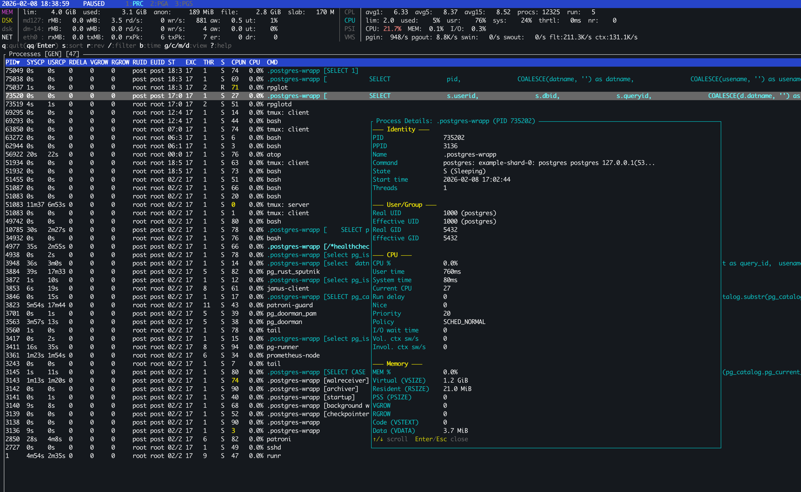

# rpglot

**rpglot** — инструмент мониторинга системы и PostgreSQL, написанный на Rust. Вдохновлён [atop](https://github.com/Atoptool/atop), но с глубокой интеграцией PostgreSQL.



## Возможности

- 📊 Мониторинг процессов в реальном времени (CPU, память, диск I/O)
- 🐘 Глубокая интеграция с PostgreSQL (pg_stat_activity, pg_stat_statements)
- 📁 Запись метрик на диск для последующего анализа
- 🖥️ Интерактивный TUI-интерфейс в стиле atop/htop
- 🐳 Автоматическое определение контейнерной среды (cgroup)
- 🔗 Drill-down навигация между процессами и PostgreSQL сессиями

---

## Установка и сборка

```bash
# Сборка проекта
cargo build --release

# Бинарные файлы будут в target/release/
# rpglotd - демон сбора метрик
# rpglot  - TUI-просмотрщик
```

---

## Архитектура: два бинарных файла

### rpglotd — демон сбора метрик

Фоновый процесс, который собирает системные метрики и записывает их на диск.

```bash
# Запуск с настройками по умолчанию (интервал 10 сек, директория ./data)
rpglotd

# Пользовательские настройки
rpglotd -i 5 -o /var/lib/rpglot     # интервал 5 сек, директория /var/lib/rpglot

# Для тестирования с мок-данными /proc
rpglotd --proc-path ./mock_proc
```

**Опции:**
| Флаг | Описание |
|------|----------|
| `-i, --interval` | Интервал сбора в секундах (по умолчанию: 10) |
| `-o, --output` | Директория для хранения данных (по умолчанию: ./data) |
| `--proc-path` | Путь к /proc (для тестирования) |
| `-v` | DEBUG уровень логов |
| `-vv` | TRACE уровень логов |
| `-q` | Только ошибки (тихий режим) |

### rpglot — TUI-просмотрщик

Интерактивный терминальный интерфейс для просмотра метрик в реальном времени или из истории.

```bash
# Live режим (по умолчанию): сбор и отображение в реальном времени
rpglot              # интервал обновления 1 секунда
rpglot 5            # интервал обновления 5 секунд

# History режим: просмотр записанных данных
rpglot -r ./data    # просмотр данных из директории ./data
rpglot -r -b -1h    # начать с данных часовой давности
```

---

## Режимы TUI

### Live режим vs History режим

| Режим | Источник данных | Описание |
|-------|-----------------|----------|
| **Live** | `/proc` + PostgreSQL | Сбор и отображение метрик в реальном времени |
| **History** | Файлы на диске | Просмотр ранее записанных демоном rpglotd данных |

**Live режим:**
- Данные собираются напрямую из `/proc` и PostgreSQL
- Обновление по таймеру (1-10 сек)
- Можно поставить на паузу клавишей `Space`

**History режим:**
- Данные читаются из файлов, записанных rpglotd
- Навигация по времени: `←/→` или `t/T`
- Переход к конкретному времени: `b` (поддерживает `-1h`, `16:00`, ISO 8601, Unix timestamp)

### Baremetal режим vs Container режим

TUI автоматически определяет среду выполнения и адаптирует отображение:

**Baremetal (физический/виртуальный сервер):**
- Полное отображение всех CPU ядер
- Все диски и сетевые интерфейсы
- Своп и полная информация о памяти

**Container (cgroup):**
- CPU метрики на основе квоты контейнера
- Память с учётом лимитов (`memory.max`)
- Только диски, примонтированные в контейнер
- Сетевые интерфейсы: только `eth*`/`veth*`
- Своп скрыт (не актуален для контейнеров)

---

## Вкладки TUI

Переключение между вкладками: `Tab`, `Shift+Tab` или цифры `1`, `2`, `3`.

### PRC — Процессы (Process)

Вкладка отображает список всех процессов системы с метриками CPU, памяти и I/O.

**Представления (переключение клавишами):**

| Клавиша | Режим | Колонки |
|---------|-------|---------|
| `g` | Generic | PID, SYSCPU, USRCPU, RDELAY, VGROW, RGROW, RUID, EUID, ST, EXC, THR, S, CPUNR, CPU, CMD |
| `c` | Command | PID, TID, S, CPU, MEM, COMMAND-LINE (полная командная строка) |
| `m` | Memory | PID, TID, MINFLT, MAJFLT, VSTEXT, VSLIBS, VDATA, VSTACK, LOCKSZ, VSIZE, RSIZE, PSIZE, VGROW, RGROW, SWAPSZ, RUID, EUID, MEM, CMD |
| `d` | Disk | PID, RDDSK, WRDSK, WCANCL, DSK, CMD |

**Связь с PGA:**
- Если PID процесса соответствует backend PostgreSQL, в колонке CMD отображается текущий SQL-запрос или тип backend (например `[SELECT * FROM ...]` или `[autovacuum worker]`)
- Процессы PostgreSQL подсвечиваются **голубым** цветом
- Клавиша `>` или `J` — переход к сессии PostgreSQL по PID (drill-down в PGA)

### PGA — PostgreSQL Activity

Вкладка отображает активные сессии PostgreSQL из `pg_stat_activity` с OS-метриками.

**Представления:**

| Клавиша | Режим | Описание |
|---------|-------|----------|
| `g` | Generic | PID, CPU%, RSS, DB, USER, STATE, WAIT, QDUR, XDUR, BDUR, BTYPE, QUERY |
| `v` | Stats | PID, DB, USER, STATE, QDUR, MEAN, MAX, CALL/s, HIT%, QUERY (обогащён данными pg_stat_statements) |

**Колонки Generic:**

| Колонка | Описание |
|---------|----------|
| PID | ID процесса backend PostgreSQL |
| CPU% | Использование CPU (из OS) |
| RSS | Resident Set Size (из OS) |
| DB | Имя базы данных |
| USER | Имя пользователя PostgreSQL |
| STATE | Состояние: active, idle, idle in transaction |
| WAIT | Событие ожидания (например Lock:tuple) |
| QDUR | Длительность запроса |
| XDUR | Длительность транзакции |
| BDUR | Время жизни backend |
| BTYPE | Тип backend (client backend, autovacuum worker и т.д.) |
| QUERY | Текст запроса |

**Колонки Stats (с данными pg_stat_statements):**

| Колонка | Описание |
|---------|----------|
| MEAN | Среднее время выполнения запроса |
| MAX | Максимальное время выполнения |
| CALL/s | Вызовов в секунду |
| HIT% | Процент попаданий в buffer cache |

**Подсветка аномалий в Stats режиме:**
- 🟡 Жёлтый: QDUR > 2× MEAN
- 🔴 Красный: QDUR > 5× MEAN или QDUR > MAX
- 🟡 Жёлтый: HIT% < 80%
- 🔴 Красный: HIT% < 50%

**Связи:**
- С **PRC**: Колонки CPU% и RSS получены из OS-процесса по PID
- С **PGS**: Клавиша `>` или `J` — переход к статистике запроса по query_id (drill-down в PGS)

**Дополнительно:**
- `i` — скрыть/показать idle сессии
- Idle сессии отображаются серым цветом внизу списка

### PGS — PostgreSQL Statements

Вкладка отображает статистику запросов из `pg_stat_statements` (TOP 500 по `total_exec_time`).

**Представления:**

| Клавиша | Режим | Фокус |
|---------|-------|-------|
| `t` | Time | Временные метрики (total/mean/min/max) |
| `c` | Calls | Частота вызовов (hot paths) |
| `i` | I/O | Shared buffer reads/hits/writes |
| `e` | Temp | Temp blocks / индикаторы spill |

**Особенности:**
- Большинство метрик — **rate** (в секунду, `/s`), вычисленные из дельт между снимками
- В заголовке таблицы показано:
  - `dt=Xs` — интервал между двумя реальными снимками pg_stat_statements
  - `age=Ys` — время с последнего реального сбора

**Связь с PGA:**
- Сессии из PGA могут быть связаны с записями PGS через `query_id` (PostgreSQL 14+)

---

## Drill-down навигация

Drill-down позволяет "провалиться" от общего к частному:

```
PRC (процессы) → PGA (сессии PostgreSQL) → PGS (статистика запросов)
```

| Откуда | Куда | Клавиша | Связь |
|--------|------|---------|-------|
| PRC | PGA | `>` или `J` | По PID процесса |
| PGA | PGS | `>` или `J` | По query_id |

**Пример использования:**
1. В PRC видите процесс postgres с высоким CPU
2. Нажимаете `>` — переходите в PGA к этой сессии
3. Видите активный запрос, нажимаете `>` — переходите в PGS к статистике этого запроса
4. Анализируете среднее время, количество вызовов, cache hit ratio

**Отслеживание выделения:**
- После drill-down выделение "следит" за PID или query_id, а не за индексом строки
- При обновлении данных выделенная сессия/запрос остаётся выделенной

---

## Детальные описания строк (Popup)

Нажмите `Enter` на выделенной строке для открытия детального popup-окна.

### PRC — Детали процесса

| Секция | Поля |
|--------|------|
| Identity | PID, PPID, Name, Command, State, TTY, Start time, Threads |
| User/Group | Real UID/User, Effective UID/User, Real GID, Effective GID |
| CPU | CPU%, User time, System time, Current CPU, Run delay, Nice, Priority, RT Priority, Policy, I/O wait time, Vol. ctx sw/s, Invol. ctx sw/s |
| Memory | MEM%, Virtual, Resident, PSS, VGROW, RGROW, Code, Data, Stack, Libraries, Locked, Swap, Minor/Major faults |
| Disk I/O | Read ops, Read bytes, Write ops, Write bytes, Cancelled writes |

### PGA — Детали сессии PostgreSQL

| Секция | Поля |
|--------|------|
| Session Identity | PID, Database, User, Application, Client Address, Backend Type |
| Timing | Backend Start, Transaction Start, Query Start, Query/Transaction/Backend Duration |
| State & Wait | State, Wait Event Type, Wait Event |
| OS Process | OS PID, Threads, State, User/System Time, CPU, Nice, Priority, Memory (Virtual/RSS/Shared/Swap), Page Faults, Disk I/O |
| Query | Полный текст запроса (с прокруткой) |

### PGS — Детали запроса

| Секция | Поля |
|--------|------|
| Rates (/s) | calls/s, time_ms/s, I/O/s |
| Identity | queryid, db, user, calls, rows |
| Timing | total/mean/min/max/stddev, plan time |
| I/O | shared/local/temp blocks, cache hit% |
| Temp/WAL | temp blocks, estimated temp MB, WAL records/bytes |
| Query | Полный нормализованный текст запроса |

**Навигация в popup:**
- `↑/↓`, `j/k` — прокрутка
- `PgUp/PgDn` — постраничная прокрутка
- `Enter` или `Esc` — закрыть

---

## Горячие клавиши

### Общие

| Клавиша | Действие |
|---------|----------|
| `q` | Выход (требуется подтверждение: `q` повторно или `Enter`) |
| `Ctrl+C` | Принудительный выход |
| `Tab`, `Shift+Tab` | Переключение вкладок |
| `1`, `2`, `3` | Прямой переход к вкладке (1=PRC, 2=PGA, 3=PGS) |
| `Space` | Пауза/возобновление (только Live режим) |
| `?`, `H` | Показать/скрыть справку |
| `Enter` | Открыть детальный popup |
| `Esc` | Закрыть popup |

### Навигация по истории (History режим)

| Клавиша | Действие |
|---------|----------|
| `←`, `→` | Предыдущий/следующий снимок |
| `t` | Следующий снимок (кроме PGS, где `t` — переключение режима) |
| `T` | Предыдущий снимок |
| `b` | Переход к конкретному времени |

### Навигация по таблице

| Клавиша | Действие |
|---------|----------|
| `↑/↓`, `j/k` | Перемещение по строкам |
| `PgUp/PgDn` | Постраничная навигация |
| `Home/End` | В начало/конец |
| `h/l` | Горизонтальная прокрутка (для широких таблиц) |

### Сортировка и фильтрация

| Клавиша | Действие |
|---------|----------|
| `s/S` | Следующая колонка сортировки |
| `r/R` | Обратная сортировка |
| `/` | Режим фильтрации |
| `p/P` | Режим фильтрации (стиль atop) |
| `i/I` | PGA: скрыть idle сессии; PGS: переключить на I/O режим |
| `Esc` | Отменить фильтр |
| `Enter` | Применить фильтр |

### Drill-down

| Клавиша | Действие |
|---------|----------|
| `>`, `J` | Переход к связанной записи (PRC→PGA, PGA→PGS) |

### Переключение представлений

**PRC:**
| Клавиша | Режим |
|---------|-------|
| `g/G` | Generic |
| `c/C` | Command |
| `m/M` | Memory |
| `d/D` | Disk |

**PGA:**
| Клавиша | Режим |
|---------|-------|
| `g/G` | Generic |
| `v/V` | Stats |

**PGS:**
| Клавиша | Режим |
|---------|-------|
| `t` | Time |
| `c` | Calls |
| `i` | I/O |
| `e` | Temp |

---

## Summary панель

В верхней части экрана отображается сводная информация о системе в двухколоночном формате:

**Левая колонка (память/хранилище/сеть):**
- **MEM**: Общая память, доступная, cache, buffers, slab
- **SWP**: Своп (total/free/used), dirty pages, writeback
- **DSK**: Дисковая статистика (rMB/wMB/s, IOPS, await, util%)
- **NET**: Сетевая статистика (rxMB/txMB/s, пакеты, ошибки, drops)

**Правая колонка (CPU/нагрузка):**
- **CPL**: Load average (1/5/15 мин), количество процессов
- **CPU**: Общая загрузка (sys/usr/irq/iow/idle/steal)
- **cpu**: Топ-5 самых загруженных ядер
- **PSI**: Pressure Stall Information (CPU/MEM/I/O)
- **VMS**: Vmstat rates (pgin/pgout/swin/swout/flt/ctx в секунду)

**Цветовая индикация аномалий:**
- 🟡 Жёлтый — предупреждение
- 🔴 Красный — критично

---

## Примеры использования

### Мониторинг в реальном времени

```bash
# Запуск TUI с интервалом 1 секунда
rpglot

# С интервалом 5 секунд (меньше нагрузки на систему)
rpglot 5
```

### Запись и анализ истории

```bash
# Запуск демона для записи
rpglotd -i 5 -o /var/log/rpglot

# Позже: анализ записанных данных
rpglot -r /var/log/rpglot

# Переход к данным часовой давности
rpglot -r /var/log/rpglot -b -1h

# Переход к конкретному времени
rpglot -r /var/log/rpglot -b 2024-01-15T14:30:00
```

### Отладка медленного запроса PostgreSQL

1. Запустите `rpglot`
2. Перейдите на вкладку **PGA** (клавиша `2`)
3. Найдите сессию с высоким **QDUR** (отсортируйте клавишей `s`)
4. Нажмите `Enter` для просмотра деталей
5. Нажмите `>` для перехода к статистике запроса в **PGS**
6. Проанализируйте **HIT%**, **MEAN**, **MAX** для понимания проблемы

---

## Лицензия

MIT
